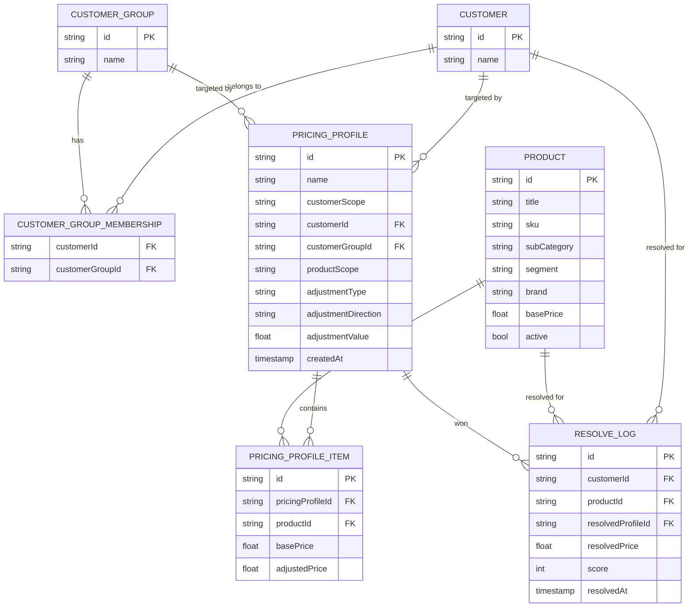

# Customer Pricing App — Documentation

F&B supplier tool for creating bespoke per-customer pricing profiles with automatic overlap resolution based on specificity scoring.

---

## Prerequisites

- Node.js ≥ 18
- npm ≥ 9
- Git

---

## Quick Start

```bash
# 1. Clone
git clone <repo-url>
cd customer-pricing-app

# 2. Backend — Terminal 1
cd backend
npm install
npm run dev

# 3. Frontend — Terminal 2
cd frontend
npm install
npm run dev
```

### Access Points

| Service | URL |
|---|---|
| App | http://localhost:5173 |
| API | http://localhost:4000 |
| Swagger UI | http://localhost:4000/api-docs |
| Health check | http://localhost:4000/api/health |

No `.env` file needed — all defaults work out of the box. Backend `PORT` defaults to `4000`.

---

## Project Structure

```
customer-pricing-app/
├── backend/
│   ├── src/
│   │   ├── server.ts                  # Express app, CORS, route mounting
│   │   ├── swagger.ts                 # OpenAPI 3.0 spec
│   │   ├── data/                      # In-memory seed data (no DB)
│   │   │   ├── products.ts
│   │   │   ├── customers.ts
│   │   │   ├── customerGroups.ts
│   │   │   ├── customerGroupMemberships.ts
│   │   │   └── pricingProfiles.ts
│   │   ├── routes/                    # Express route handlers
│   │   └── utils/
│   │       ├── pricing.ts             # Adjustment calculation
│   │       └── resolver.ts            # Specificity scoring algorithm
│   ├── package.json
│   └── tsconfig.json
├── frontend/
│   ├── src/
│   │   ├── App.tsx                    # Root layout + sidebar navigation
│   │   ├── pages/
│   │   │   ├── PricingPage.tsx        # Profile creation UI
│   │   │   ├── ResolvePage.tsx        # Price resolution tester
│   │   │   ├── PricingProfilesPage.tsx
│   │   │   └── CustomerGroupMembershipsPage.tsx
│   │   ├── components/                # Reusable UI (shadcn/ui + custom)
│   │   ├── api/                       # HTTP client wrappers
│   │   ├── types/                     # Shared TypeScript types
│   │   └── utils/                     # pricing.ts, sleep.ts helpers
│   ├── package.json
│   └── vite.config.ts
├── documentation.md                   # ← this file
├── product-description.md             # Full product spec (source of truth)
├── CLAUDE.md                          # Claude behavior config
└── transcripts/                       # Phase-by-phase dev conversation history
```

---

## Data Model



---

## Key Reference Files

### `product-description.md`
The **complete product specification** — all flows, adjustment formulas, pricing rules, API contracts, and demo data scenarios. Read this first to understand the full scope of the app.

### `transcripts/`
Phase-by-phase conversation history between the developer and Claude. Each file (e.g. `phase-4.md`, `phase5.md`) captures the decisions, code, and reasoning from each dev session. Useful for understanding *why* something was built a certain way.

### `CLAUDE.md`
Controls Claude's response behavior in this project — sets conventions for commit messages (concise, grammar optional), PR comment format (checkbox TODOs), and plan output style. Update this file to adjust how Claude collaborates on this project.

---

## Pages

| Page | Purpose |
|---|---|
| **Pricing** | Create pricing profiles — set scope, select products, configure adjustment, preview, save |
| **Resolve** | Test price resolution — pick a customer + products, click Resolve, see which profile wins |
| **Pricing Profiles** | List, edit, delete existing profiles |
| **Customer Group Memberships** | Assign customers to groups |

---

## API Reference

| Method | Path | Description |
|---|---|---|
| GET | `/api/products` | List products; filter by `search`, `sku`, `subCategory`, `segment`, `brand` |
| GET | `/api/customers` | List customers with group memberships |
| GET | `/api/customer-groups` | List customer groups |
| GET | `/api/pricing-profiles` | List all profiles |
| GET | `/api/pricing-profiles/:id` | Get profile by ID |
| POST | `/api/pricing-profiles` | Create profile; snapshots items at current base prices |
| PUT | `/api/pricing-profiles/:id` | Update profile name; recomputes items |
| DELETE | `/api/pricing-profiles/:id` | Delete profile |
| GET | `/api/resolve?customerId=X&productId=Y` | Resolve price for one customer + product |
| GET | `/api/resolve/batch?customerId=X&productIds=A,B` | Batch resolve multiple products |
| GET | `/api/health` | Health check |
| GET | `/api-docs` | Swagger UI |

Full request/response schemas: http://localhost:4000/api-docs

---

## Demo Data (seeded)

### Products

| ID | Title | SKU | Sub-Category | Base Price |
|---|---|---|---|---|
| prod_1 | High Garden Pinot Noir 2021 | HGVPIN216 | Red | $279.06 |
| prod_2 | Koyama Methode Brut Nature NV | KOYBRUNV6 | Sparkling | $120.00 |
| prod_3 | Koyama Riesling 2018 | KOYNR1837 | Port/Dessert | $215.04 |
| prod_4 | Koyama Tussock Riesling 2019 | KOYRIE19 | White | $215.04 |
| prod_5 | Lacourte-Godbillon Brut Cru NV | LACBNATNV6 | Sparkling | $409.32 |

### Customers & Groups

| Customer | Groups |
|---|---|
| The Cellar Door | — |
| Harbour View Restaurant | — |
| Blue Mountains Bistro | — |
| Fitzroy Food & Wine | — |
| Manly Beach Bar | — |
| Bondi Cellars | Independent Retailers, VIP |

### Pre-seeded Profiles (Overlap Scenario)

Three pricing profiles are pre-loaded on startup to demonstrate overlap resolution.

| Profile | Rule | Customer Scope | Product Scope | Score |
|---|---|---|---|---|
| A | −10% all Wine | Independent Retailers (group) | Segment | 1 |
| B | −$15 Sparkling Wine | VIP (group) | Sub-category | 5 |
| C | Custom $95 on Koyama Brut | Bondi Cellars (individual) | Exact product | **20** ← wins |

---

## Core Concepts

### Adjustment Types

| Type | Formula |
|---|---|
| Fixed $ | `New = Base ± amount` |
| Percentage % | `New = Base ± (rate% × Base)` |
| Custom Price | `New = target` (ignores base) |

Prices are floored at `$0.00`. Saving is blocked if any product would reach `$0`.

### Specificity Scoring

When multiple profiles match a customer + product, the highest-scoring profile wins. Ties go to the newer profile.

| Dimension | Rule | Score |
|---|---|---|
| Customer | Individual | +10 |
| Customer | Group | +0 |
| Product | Exact (one / explicit list) | +10 |
| Product | Sub-category | +5 |
| Product | Segment | +1 |
| Product | All products | +0 |

For full pricing rules and edge cases, see [`product-description.md`](./product-description.md).

---

## Tech Stack

| Layer | Stack |
|---|---|
| Frontend | React 18, Vite, TypeScript, Tailwind CSS, shadcn/ui, TanStack Query |
| Backend | Node.js, Express 5, TypeScript, tsx (dev), swagger-jsdoc |
| Data | In-memory (no database) |
| Notifications | Sonner |
| Icons | Lucide React |

---

## Development Tools

| Tool | Purpose |
|---|---|
| VS Code | Primary editor |
| Claude Code | AI pair programming (Claude Code CLI) |
| Swagger UI | API explorer — http://localhost:4000/api-docs |
